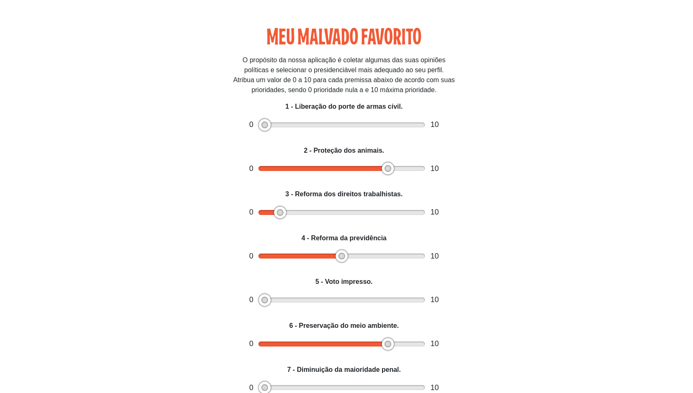
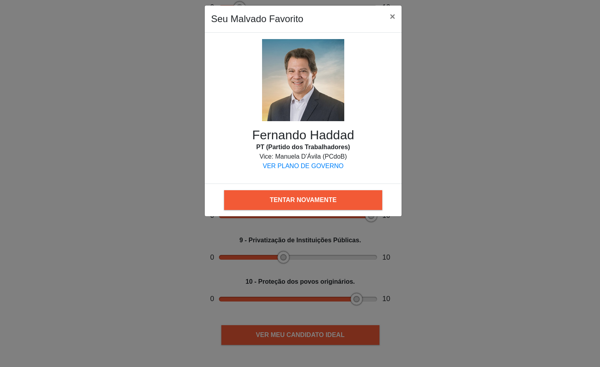

# Meu Malvado Favorito

**Conteúdo da Disciplina**: Divide & Conquer<br>

## Alunos

| Matrícula  | Aluno            |
| ---------- | ---------------- |
| 18/0030345 | Arthur Sena      |
| 18/0033646 | João Luis Baraky |

## Sobre
O projeto tem como objetivo coletar algumas informações dos usuários sobre assuntos políticos e apresentar o candidato mais adequado de acordo com suas preferências. É selecionado o candidato com o menor número de inversões, utilizando o algoritmo em sua versão Dividir e Conquistar.


## Screenshots




## Instalação

**Linguagem**: JavaScript<br>
**Framework**: React<br>
É necessário possuir o node instalado na máquina.

```powershell
# Clone o repositório
git clone https://github.com/projeto-de-algoritmos/DC_MeuMalvadoFavorito.git

# Entre no diretório e instale as dependencias
cd DC_Dupla3 && npm install

# Inicie o projeto
npm start

# Visite o endereço localhost:3000 no seu navegador
```

## Uso

Para utilizar a aplicação basta atribuir para cada pergunta um valor de 0 a 10 de acordo com sua prioridade no contexto político. Em seguida, basta consultar qual é o candidato que mais se aproxima das suas preferências.
